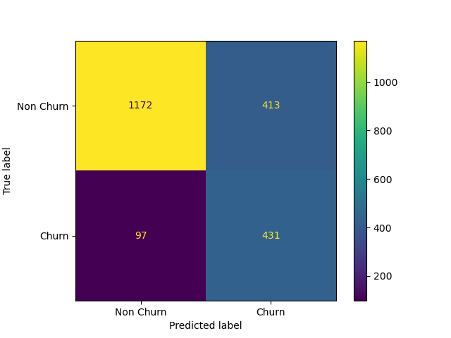
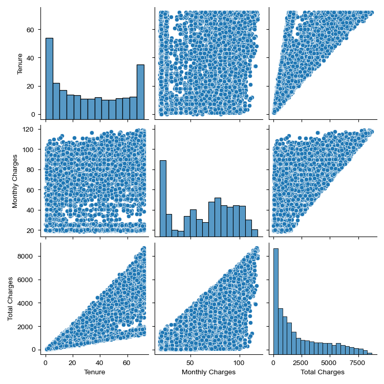
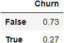
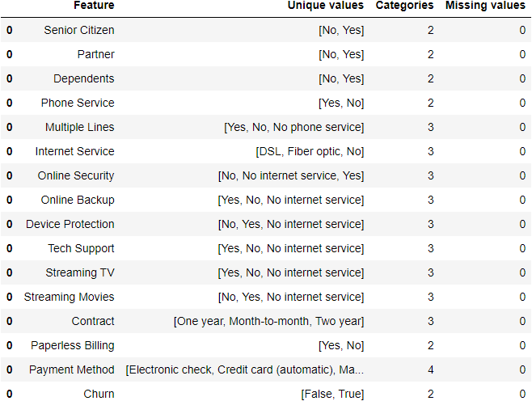

```{r setup, include=FALSE}
knitr::opts_chunk$set(echo = TRUE)
library(knitr)
library(tidyverse)
```

```{r out.width = '30%'}

```

```{r  echo=FALSE,  out.width = '30%'}
knitr::include_graphics("../results/figure_3_numeric_feat_corr.png")
```

```{r  echo=FALSE,  out.width = '30%'}

```

```{r  echo=FALSE,  out.width = '30%'}

```

```{r  echo=FALSE,  out.width = '30%'}

```

# Summary

In this project, we attempt to examine the following question: Consider certain telecommunications customer characteristics, predict the likelihood that a given customer is likely to churn, and further understand what customer characteristics are positively associated with high churn risk. We performed a analysis, which yield the

# Introduction

Customer churn risk, the risk of customers switching to another company, is considered one of the most significant threats to the revenue of telecommunication companies. (@pustokhina2021multi) The average churn rate in the telecom industry is approximately 1.9% per month, which translates to discontinued service for one in fifty subscribers of a given company.(@team_2020) Moreover, it is known that the cost of acquiring new customers is significantly higher than the cost of retaining them. (@pustokhina2021multi) Thus, it is clear that reducing churn risk and increasing customer retention rate is a key strategic challenge in the telecommunication industry. In our project, we are identifying a predictive classification model that can provide insights into which customers (based on their traits) are at higher risk of churning. Answering this question has important practical managerial implications for telecommunication companies because it is a crucial step in understanding how to reduce this risk and thus create higher customer lifetime value. Further, this predictive tool will be considered a contribution to the modern telecommunication customer relationship management systems.

# Methods

## Data

The dataset we are using comes from the public IBM github page, and is made available as part of an effort (by IBM) to teach the public how to use some of their machine learning tools. Unfortunately no mention is made of exactly how the data was collected, or who was responsible for the collection. Here is a link to the [mini-course](https://developer.ibm.com/patterns/predict-customer-churn-using-watson-studio-and-jupyter-notebooks/) that references the dataset we are using. The raw data is [here](https://raw.githubusercontent.com/IBM/telco-customer-churn-on-icp4d/master/data/Telco-Customer-Churn.csv), and lives inside the data folder of the [public repository](https://github.com/IBM/telco-customer-churn-on-icp4d) for the mini-course. Each row in the dataset corresponds to a single customer. There are 19 feature columns, along with the target column, "churn".

## Data Cleaning and Preprocessing

Various cleaning transformations have been made to the raw data frame. Note that we are applying feature engineering transformations inside the training analysis script, instead of applying the transformations on the entire raw data set. This will avoid validating the model on pre processed data, since this would cause the training fold to be transformed relative to the validation fold, which can cause information to leak from the validation fold in to the training folds. By applying the transformation pipeline in the analysis script, we are avoiding training bias and improve generalization of the final model.

First, `TotalCharges` feature has been converted into float64 datatype. Null values in this feature are encoded as blank spaces, we we first replace the spaces with `None` values, and then covert the entire feature to a float. To improve consistency of the data frame, we are also converting the `SeniorCitizen` feature into Strings "Yes" and "No" instead of 1 and 0, which will match how the other categories are encoded. Finally, we are splitting the data frame into training and testing splits, with 30% of the data (2113 observations) being left as the cleaned testing set.

We are also dropping `gender` from the data frame due to ethical limitations of discriminating on gender for what makes customers likely to leave the company. `CustomerID` is dropped from the data as well, since it is not useful for prediction.

## Analysis

We used a logistic regression algorithm to build a classification model to predict which customers are likely to churn from their telecommunications company. Additionally, we reported which features are most positively & negatively correlated with our target, as learned by our model. We used the Python language[@Python] and the following Python packages were used to perform this analysis: docopt [@docopt], os [@Python], scikit-learn [@scikit-learn], Pandas [@reback2020pandas], Numpy Array[@2020NumPy-Array], matplotlib [@hunter2007matplotlib]and altair [@vanderplas2018altair]. We used the R language[@python] and the following R packages were used to perform this analysis: knitr [@knitr], tidyverse [@tidyverse]. Our code for the analysis and our related resources and progress reports can be found here: (<https://github.com/UBC-MDS/Telco_Customer_Churn_Prediction_Group12>)

# Results & Discussion

We chose to use a simple logistic regression model, with f1 score as our primary scoring metric . To improve the performance of our model, we performed hyperparameter optimization in the form of an exhaustive grid search, with 4 cross validation folds, over hyperparameters `C` & `class_weight`. This yielded optimal parameters `C=0.01` & `class_weight="balanced"`

After training our model on our full training set, these are the features most positively correlated with Churn:

```{r positive feature importance}
feature_importance_df <- read_csv("../results/feature_importance.csv")

feature_importance_df |> 
  arrange(desc(Coefficient)) |> 
  head(5) |> 
  knitr::kable(caption = "Summary of features most positively correlated with Churn") 
```

These are the features most negatively correlated with Churn:

```{r}
feature_importance_df |> 
  arrange(Coefficient) |> 
  head(5) |> 
  knitr::kable(caption = "Summary of features most negatively correlated with Churn") 
```

On test data our model had satisfactory performance. With consideration to the "Churn" class, our model had an f1 score of \~0.63, a recall score of \~0.82, and a precision score of 0.51.

```{r}
classification_report_df <- read_csv("../results/classification_report.csv")

classification_report_df |> knitr::kable(caption = "Classification report on test data.")
```

Given the business problem that our prediction algorithm is trying to solve, it was much more important for us to be able to identify the Churn class correctly (to minimize false negatives). As evidenced by the confusion matrix below, our model made 413 false positives and only 97 false negatives:

```{r confusion matrix echo=FALSE,  out.width = '30%'}

```

# Limitations & Future

# References
